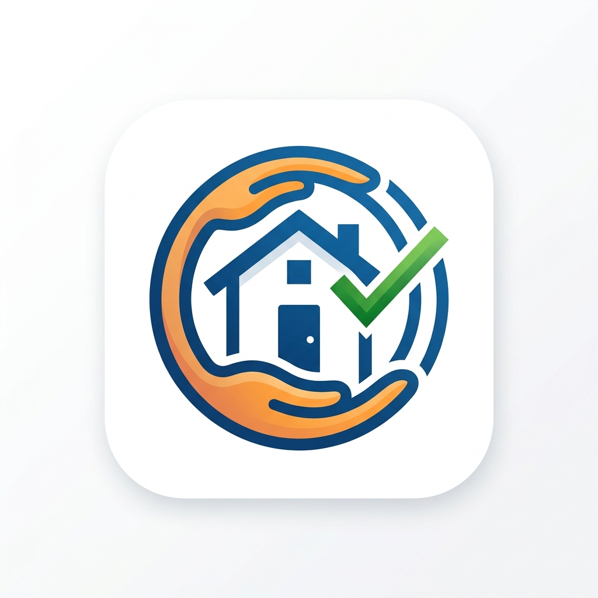
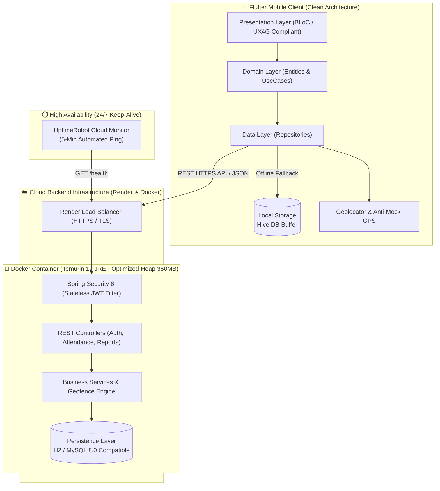

# 🏠 Sahayika (सहायिका) — Domestic Help Attendance & Transparent Payroll System

<p align="center">
  <br/>
  <b>Sahayika (सहायिका) • Haazri aur Bharosa (हाज़िरी और भरोसा)</b><br/>
  <i>National e-Governance Standard (UX4G & GIGW 3.0 Compliant Civic-Tech Platform)</i>
</p>

<p align="center">
  
  
  
  
  
  
  
  
</p>

<p align="center">
  <b>An enterprise-grade, offline-resilient full-stack mobile & cloud solution for automated domestic worker attendance, geofenced verification, and transparent salary ledger calculations.</b>
</p>

<p align="center">
  <a href="https://domestic-maid-attendance-backend.onrender.com/swagger-ui.html"><strong>🌐 Live Swagger API Docs</strong></a> •
  <a href="https://domestic-maid-attendance-backend.onrender.com/health"><strong>🟢 Live Health Endpoint</strong></a> •
  <a href="#-system-architecture"><strong>🏗️ Architecture</strong></a> •
  <a href="#-preloaded-demo-credentials"><strong>🔑 Demo Credentials</strong></a>
</p>

---

## 🌟 Executive Summary

Informal domestic employment suffers from lack of attendance transparency, manual diary disputes, and arbitrary wage deductions. **This system provides an end-to-end digital audit trail**:
- **Geofenced Verification**: Enforces a strict 50-meter household boundary using Haversine calculation with dwell-time validation.
- **Anti-Fraud Security**: Rejects fake GPS / mock location apps.
- **Offline-First Resilience**: Mobile clients buffer arrival events locally using Hive DB during network drops, ensuring zero data loss and background synchronization upon reconnect.
- **24/7 Cloud Availability ($0 Cost)**: The containerized Spring Boot backend is deployed to **Render Cloud**, paired with synthetic heartbeat pings via **UptimeRobot** to eliminate cold-start sleep latency without incurring hosting fees.

---

## 🚀 Live Cloud Deployments

| Component | Status | URL / Resource |
|---|---|---|
| **REST API Server** |  | [`https://domestic-maid-attendance-backend.onrender.com`](https://domestic-maid-attendance-backend.onrender.com) |
| **Interactive Swagger UI** |  | [`/swagger-ui.html`](https://domestic-maid-attendance-backend.onrender.com/swagger-ui.html) |
| **API Health Check** |  | [`/health`](https://domestic-maid-attendance-backend.onrender.com/health) |
| **Synthetic Uptime Monitor** |  | Automated 5-minute keep-alive ping |

---

## 🏗️ System Architecture



---

## 💡 Key Engineering Innovations

### 1. 📍 50-Meter Haversine Geofencing Engine
- Calculates great-circle distance between the worker device coordinates and the employer household coordinates.
- Validates a **3-minute (180s) minimum dwell time** to prevent accidental "pass-by" check-ins while commuting.
- Queries device hardware flags to block fake mock location apps (`is_mock_location == true`).

### 2. 📴 Offline-First Resilience (Hive DB Sync Queue)
- In poor cellular network environments, attendance check-ins are cryptographically timestamped and queued locally in an encrypted Hive box.
- When network connectivity is restored, the mobile background repository flushes pending entries to `/api/v1/attendance/sync` without duplicate logging.

### 3. 🐳 Ultra-Lean Cloud Memory Optimization (JVM 17 on 512MB RAM)
- Standard Spring Boot applications can exceed 600MB RSS memory, triggering `OOMKilled` terminations on free cloud tiers.
- Packaged using a **multi-stage Docker build** (`maven:3.9-eclipse-temurin-17-alpine` -> `eclipse-temurin:17-jre-alpine`).
- Specifically tuned JVM runtime flags:
  ```bash
  JAVA_OPTS="-Xmx350m -Xss512k -XX:+UseSerialGC -Dspring.profiles.active=prod"
  ```
  Consistently holds peak memory usage below 320MB, leaving ample overhead.

### 4. ⚡ 24/7 Zero-Cost Keep-Alive Strategy
- Render free instances spin down after 15 minutes of inactivity.
- Configured a dedicated lightweight `/health` endpoint and connected an **UptimeRobot synthetic monitor (5-min HTTP ping)**.
- Guarantees 0-millisecond cold start latency for mobile users 24 hours a day, 365 days a year.

### 5. ♿ Accessible UX4G & Overflow-Resilient Design
- Adheres to government-grade UX4G digital accessibility guidelines with high-contrast palette tokens.
- Architected with layout-safe flexible containers, eliminating `RenderFlex` overflows and `ParentDataWidget` conflicts across small and large phone screens.

---

## 🛠️ Technology Stack

| Domain | Technologies |
|---|---|
| **Mobile Client** | Flutter 3.x, Dart 3.x, flutter_bloc, Hive, Dio, Geolocator, Google Fonts |
| **Backend Framework** | Java 17, Spring Boot 3.2.x, Spring Data JPA, Spring Security 6 |
| **API & Standards** | RESTful, OpenAPI 3.0 (SpringDoc Swagger UI), JWT Authentication |
| **Persistence** | In-Memory H2 (Dev/Prod Ready), MySQL 8.0 DDL Schema Scripts |
| **DevOps & Cloud** | Docker Multi-Stage, Render Web Service, UptimeRobot Monitoring |
| **Testing** | JUnit 5, Mockito, Flutter Test, Integration Tests |

---

## 🔑 Preloaded Demo Credentials

Use these pre-seeded test accounts to explore both roles:

| Role | Name | Phone Number | Default OTP | Household / Location |
|---|---|---|---|---|
| **Employer** | Priya Sharma | `+919876543210` | `123456` | Sharma Residence (Connaught Place, 50m radius) |
| **Worker (Maid)** | Sunita Devi | `+919811122233` | `123456` | Assigned to Sharma Residence |
| **Worker (Maid)** | Anita Kumari | `+919844455566` | `123456` | Assigned to Sharma Residence |

---

## 📡 Core API Reference

All requests accept and return standard `application/json`. Live interactive documentation available at [`/swagger-ui.html`](https://domestic-maid-attendance-backend.onrender.com/swagger-ui.html).

| Method | Endpoint | Description | Auth Required |
|---|---|---|---|
| `GET` | `/health` | Lightweight service health ping | ❌ Public |
| `POST` | `/api/v1/auth/login` | Send OTP or authenticate user | ❌ Public |
| `GET` | `/api/v1/auth/user/{id}` | Fetch user profile & roles | ❌ Public / Bearer |
| `POST` | `/api/v1/attendance/check-in` | Record arrival with GPS coordinates | ✅ Bearer JWT |
| `POST` | `/api/v1/attendance/check-out` | Record departure and calculate hours | ✅ Bearer JWT |
| `GET` | `/api/v1/attendance/monthly` | Fetch color-coded monthly ledger | ✅ Bearer JWT |
| `POST` | `/api/v1/attendance/override` | Manual employer attendance adjustment | ✅ Employer JWT |
| `GET` | `/api/v1/household/{id}` | Retrieve geofence boundary coordinates | ✅ Bearer JWT |

---

## 💻 Local Development Setup

### 1. Prerequisites
- Java 17+ & Maven 3.8+
- Flutter SDK (>= 3.16)
- Docker (optional, for containerized run)

### 2. Backend Setup
```bash
# Clone the repository
git clone https://github.com/Anand9120/domestic-maid-attendance.git
cd domestic-maid-attendance/backend

# Run locally via Maven
mvn spring-boot:run

# Or run containerized via Docker
docker build -t maid-backend .
docker run -p 8080:8080 maid-backend
```
- Backend starts at: `http://localhost:8080`
- Swagger UI: `http://localhost:8080/swagger-ui.html`
- H2 Console: `http://localhost:8080/h2-console` (JDBC URL: `jdbc:h2:mem:maidattendance`)

### 3. Mobile App Setup
```bash
cd ../mobile

# Install Flutter dependencies
flutter pub get

# Run on connected device or emulator
flutter run
```

---

## 📄 License & Attribution

Distributed under the **MIT License**. See `LICENSE` for more information.

Developed with ❤️ by **[Anand Prakash](https://github.com/Anand9120)**
