# 📄 RFP & Functional Flow Specification
## Sahayika (सहायिका) — Zero-Touch Domestic Help Attendance & Transparent Payroll System

---

## 📑 Document Control & Metadata

| Attribute | Details |
| :--- | :--- |
| **Project Title** | Sahayika (सहायिका) — Domestic Attendance & Payroll Verification Platform |
| **System Tagline** | *हाज़िरी और भरोसा (Dignity, Presence & Trust)* |
| **Document Type** | Request For Proposal (RFP) / System Architecture & Operational Blueprint |
| **Version** | 3.5 (Production & UAT Ready) |
| **Standards Compliance** | UX4G (National e-Governance Standard), GIGW 3.0 (WCAG 2.1 AAA), NPCI UPI Spec |
| **Target Platforms** | Android (Mobile App), Spring Boot (Cloud Backend), MySQL 8.0 (Relational Storage) |
| **Status** | Approved for Implementation & Deployment |

---

## 1. Executive Summary & Problem Statement

### 1.1 The Challenge in Informal Domestic Employment
Across urban Indian residential complexes, gated communities, and standalone houses, over **50 million domestic workers (maids, cooks, caretakers)** form the invisible backbone of urban households. However, this sector operates almost entirely on informal, unwritten arrangements:
1. **Attendance Disputes**: Disagreements between employers and helpers over days worked, late arrivals, half-days, and sudden unannounced absences.
2. **Salary Friction & Deduction Confusion**: Mental math and manual diary entries lead to disputes at the start of each month regarding per-day wage deductions for leaves.
3. **Lack of Verifiable Digital Proof**: Feature-phone users and informal workers lack verifiable digital audit trails to prove their continuous presence, denying them access to micro-credit, formal banking, or government welfare subsidies.
4. **Biometric & Intrusive Hardware Failure**: Physical fingerprint scanners or society gate tablets create queues, hygiene concerns, high maintenance overhead, and privacy issues.

### 1.2 The Sahayika Solution
**Sahayika (सहायिका)** introduces a **zero-touch, non-intrusive, automated geofencing and dwell-time attendance verification platform** tailored to Indian societal conditions. 
- **Zero Manual Clicks Required**: Uses OS-level geofencing (50-meter perimeter) around employer residences.
- **3-Minute Dwell-Time Filter**: Eliminates false triggers caused by passing through corridors, stairwells, or society roads.
- **Offline-First Resilience**: Local encrypted buffer (Hive DB) guarantees seamless attendance logging in elevator dead-zones or basement flats.
- **Transparent Pro-Rata Payroll & UPI**: Computes precise monthly allowances, absent deductions, and triggers one-tap NPCI UPI salary payouts with instant bilingual WhatsApp salary slips.
- **Dignified National Design**: Complies 100% with Government of India **UX4G Design System** and **GIGW 3.0** accessibility guidelines.

---

## 2. Stakeholders & User Personas

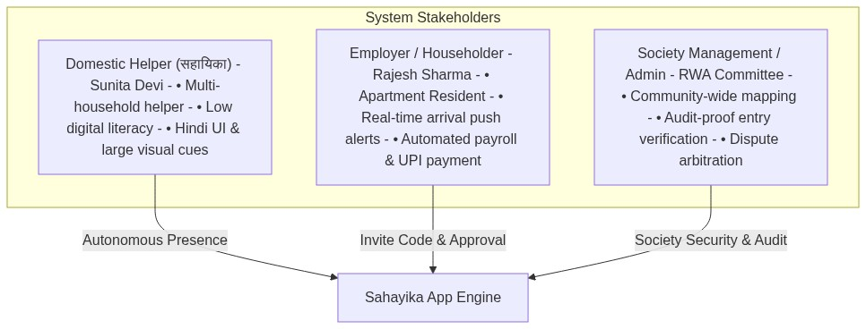

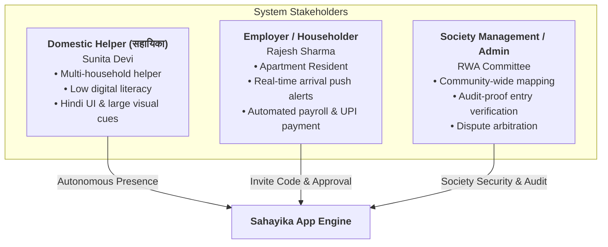

### 2.1 Persona A: Smt. Sunita Devi (Gharelu Sahayika)
- **Role**: Works in 4 different flats across Tower B & C in a residential society (morning and evening shifts).
- **Tech Literacy**: Basic smartphone user, prefers Hindi vernacular interface, audio/haptic feedback, and zero manual input.
- **Primary Need**: Ensure her presence is recorded fairly even if the householder is asleep or away, with transparent proof of working days.

### 2.2 Persona B: Sh. Rajesh Sharma (Employer / Resident)
- **Role**: Tech-working householder with busy morning schedules.
- **Primary Need**: Wants instant push notifications when Sunita arrives, automated month-end salary calculations factoring in agreed paid leaves, and 1-tap UPI payment directly to her bank account.

### 2.3 Persona C: System Administrator & Dispute Arbiter
- **Role**: RWA Secretary / Community Admin.
- **Primary Need**: Immutable audit trails, spoof-proof GPS validation, and employer manual override logs with documented reasons.

---

## 3. End-to-End Operational Lifecycle & Process Flows

The complete operational flow of Sahayika spans seven interconnected phases:

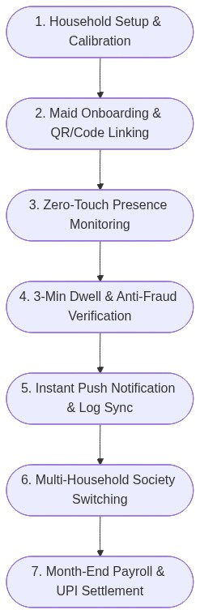

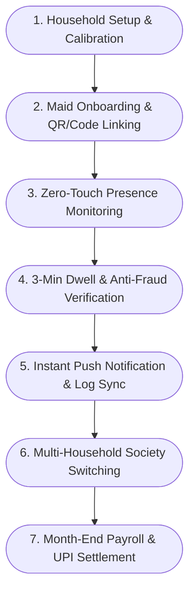

---

### Phase 1: Household Setup & GPS Calibration

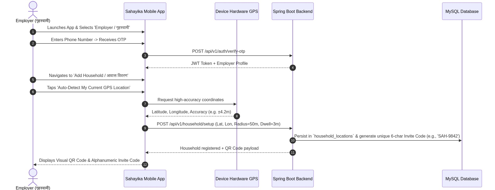

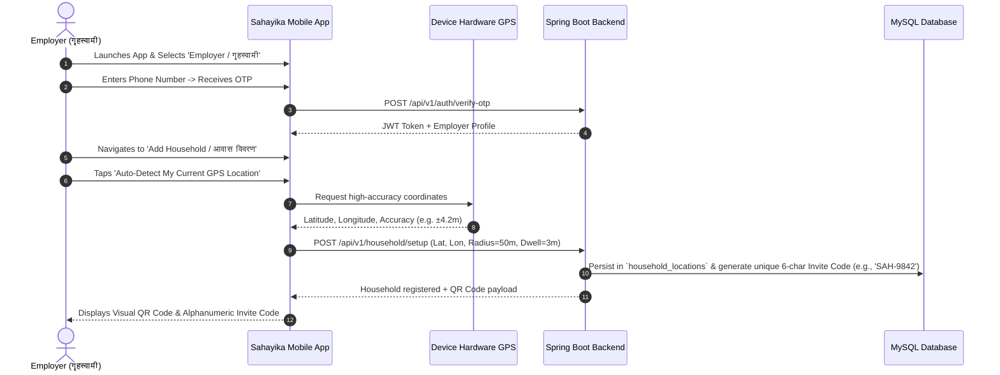

1. **Employer Registration**: The householder logs in using phone OTP authentication.
2. **Hardware Calibration**: The employer stands inside their apartment and taps **"Calibrate My Current GPS Location"**. The app polls the device hardware GPS to obtain high-precision coordinates with satellite accuracy validation.
3. **Geofence Definition**: Sets an OS-level circular geofence boundary with a default radius of **50 meters** and a **3-minute dwell time**.
4. **Invite Code Generation**: The server generates a unique alphanumeric invite code (and QR payload) for the helper.

---

### Phase 2: Maid Onboarding & Multi-Household Linking

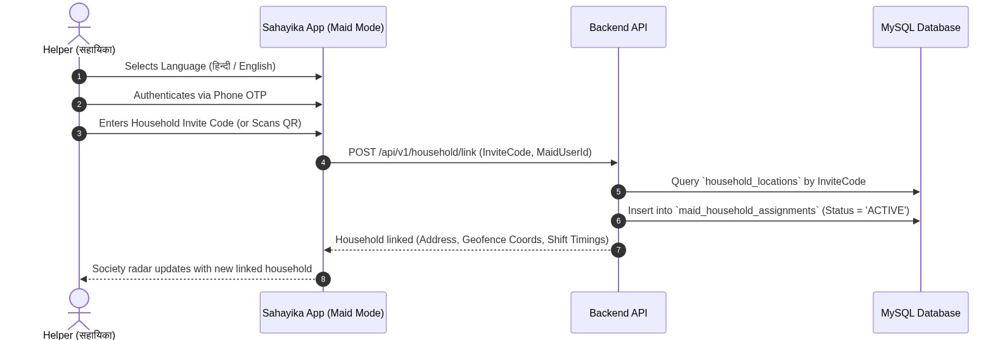

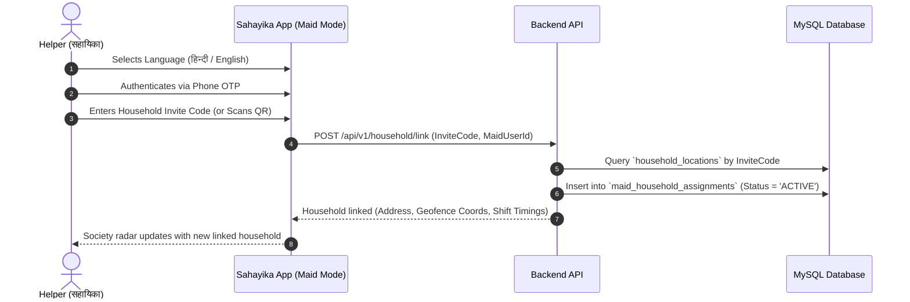

1. **Bilingual Onboarding**: Sunita launches the app, taps the top Civic Bar to select **हिन्दी**, and logs in with her phone number.
2. **Linking Residences**: She enters the 6-digit code or scans the employer's QR code.
3. **Assignment Activation**: The backend binds the maid to the household with active status. Sunita can link multiple households within the same society (e.g., Flat 101, Flat 304, Flat 502).

---

### Phase 3: Zero-Touch Attendance Pipeline & Anti-Fraud Verification

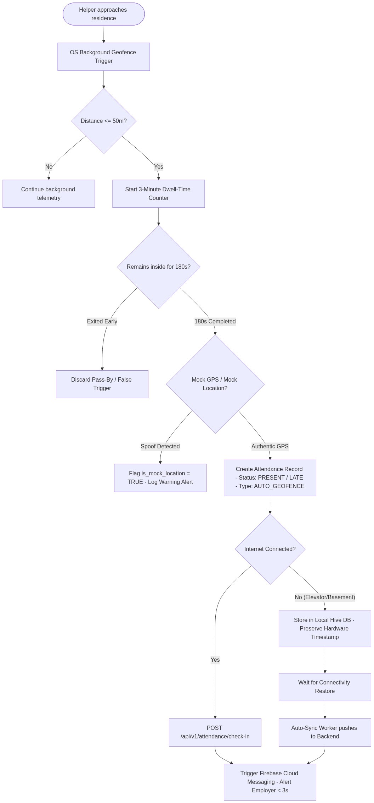

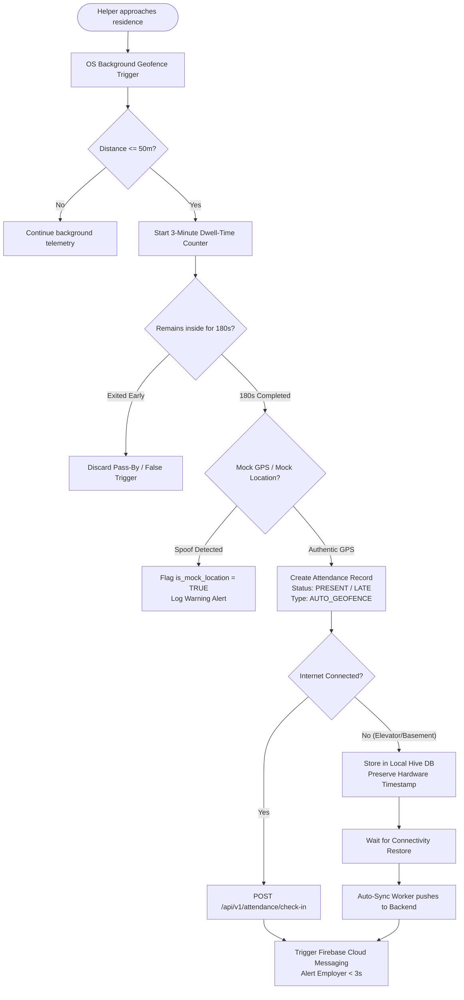

#### Detailed Logic of Attendance Pipeline:
1. **Geofence Detection**: As the helper enters within 50 meters of the employer's calibrated coordinates (calculated via the **Haversine formula**), the geofence engine registers an entry event.
2. **3-Minute Dwell-Time Gate**:
   $$\text{Dwell Duration} \ge 180 \text{ seconds}$$
   If the helper walks past the door to another floor or was merely passing through the apartment corridor, she leaves the 50m radius before 180 seconds elapse. The counter cancels automatically, preventing false check-ins.
3. **Anti-Spoofing & Mock-GPS Defense**:
   The engine queries `isFromMockProvider()` and detects fake GPS manipulation tools. If spoofing is detected, the event is immediately flagged with `is_mock_location = true` for employer review.
4. **Shift & Punctuality Engine**:
   - Compares arrival time against the configured shift schedule.
   - If arrival $\le$ Start Time + Grace Period (default 15 mins): Logged as **PRESENT (उपस्थित)**.
   - If arrival $>$ Start Time + Grace Period: Logged as **LATE (विलंब)**.
5. **Real-Time Push Notification (FCM)**:
   The backend asynchronously dispatches an urgent push notification to the employer's device:
   > *“🔔 सहायिका उपस्थित: सुनीता देवी 08:02 AM पर आपके घर पहुंच चुकी हैं (50m जियोफेंस सत्यापित)।”*

---

### Phase 4: Society Multi-Household Auto-Switching Radar

When a helper works across multiple apartments in a high-rise society, Sahayika avoids confusing manual check-ins:

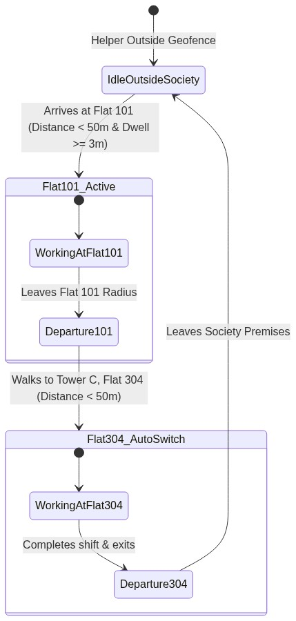

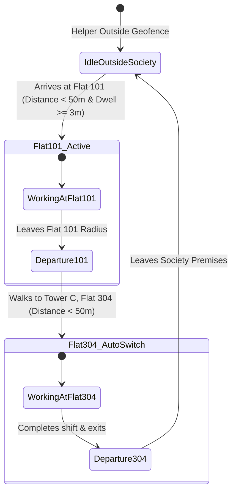

1. **Parallel Distance Computing**: The app tracks distances to all assigned society households simultaneously.
2. **Autonomous Handover**: When Sunita finishes work at Flat 101 and moves to Flat 304, the radar detects the departure from Flat 101 (logging check-out) and automatically primes the dwell-time counter for Flat 304.
3. **Zero Confusion**: Each household maintains an independent, isolated ledger and timestamp history.

---

### Phase 5: Offline-First Buffer & Auto-Sync (Elevator/Basement Resilience)

Urban buildings frequently suffer from cellular dead-zones in elevators, basements, and staircases.

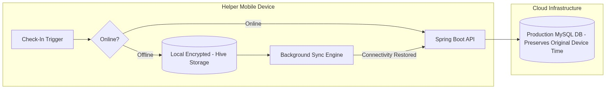

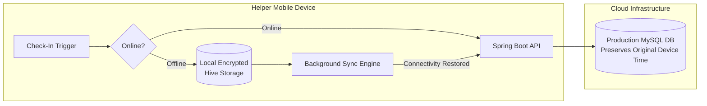

1. **Encrypted Local Storage**: Check-in events generated while offline are written into a local encrypted **Hive DB** box (`offline_attendance_box`).
2. **Hardware Timestamp Preservation**: The exact hardware time when the geofence and dwell-time were validated is preserved (preventing sync-time timestamp drift).
3. **Reactive Synchronization**: As soon as the device connects to Wi-Fi or 4G, `SyncOfflineLogsEvent` fires in the background, flushing queued records to the server without user intervention.

---

### Phase 6: Monthly Ledger, Payroll & Pro-Rata Salary Calculations

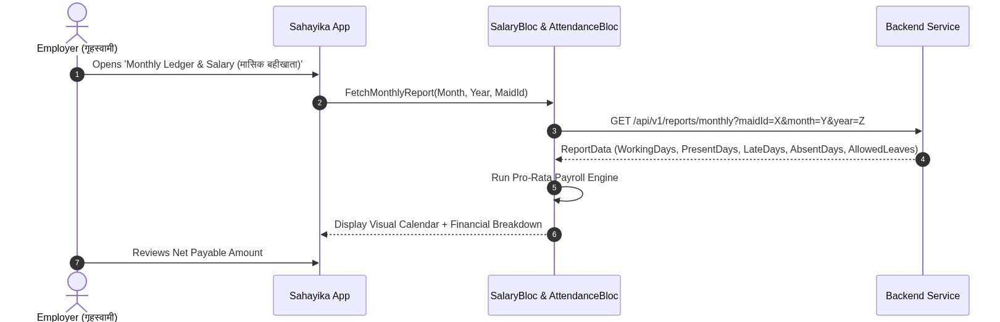

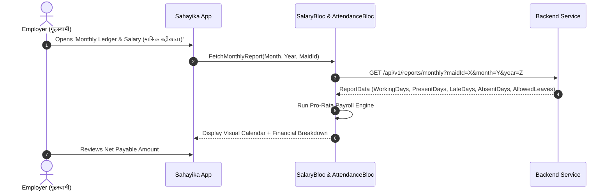

#### Mathematical Payroll Formula:
$$\text{Total Working Days} = \text{Calendar Days in Month} - \text{Designated Weekly Offs}$$

$$\text{Per-Day Wage (प्रति दिन मजदूरी)} = \frac{\text{Base Monthly Salary}}{\text{Total Working Days}}$$

$$\text{Deductible Days} = \max(0, \text{Unexcused Absent Days} + (0.5 \times \text{Half Days}) - \text{Allowed Leaves})$$

$$\text{Deduction Amount (कटौती)} = \text{Deductible Days} \times \text{Per-Day Wage}$$

$$\text{Net Payable Salary (कुल देय वेतन)} = \max(0.0, \text{Base Monthly Salary} - \text{Deduction Amount})$$

---

### Phase 7: Digital Settlement, UPI Deep-Linking & WhatsApp Slip

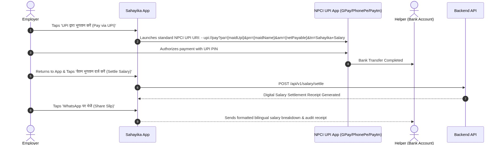

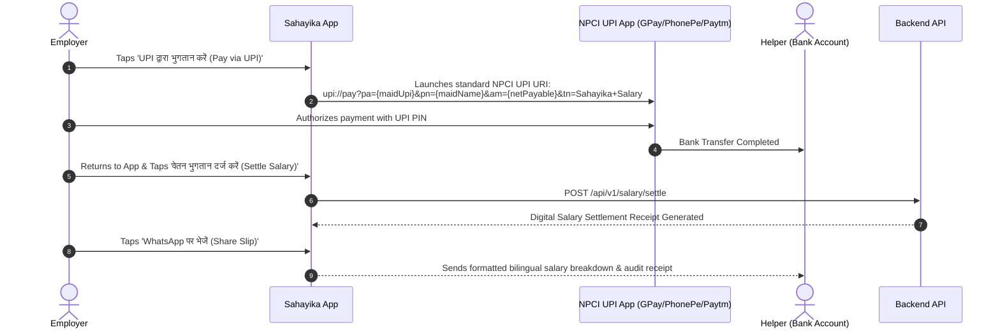

1. **NPCI Compliant UPI Launcher**: Constructs verified UPI deep-link URI (`upi://pay?pa=...&pn=...&am=...&cu=INR`).
2. **Direct Bank-to-Bank**: Zero payment gateway commissions, $0 intermediary transaction fees.
3. **One-Tap WhatsApp Receipt**: Generates a clean, transparent Hindi/English summary receipt showing base pay, days worked, approved leaves, deductions, and net amount with a digital verification ID.

---

## 4. Technical Architecture & Component Stack

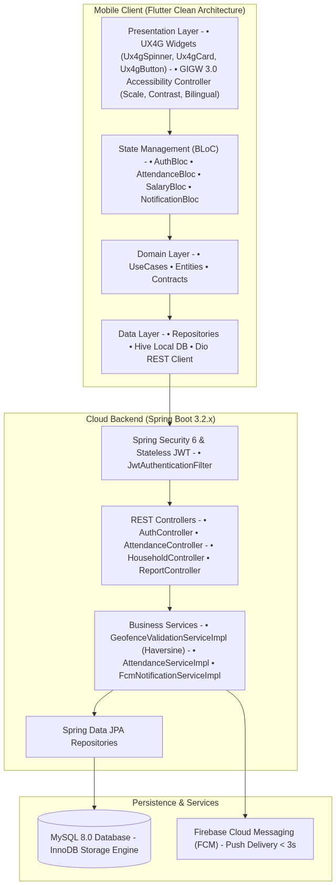

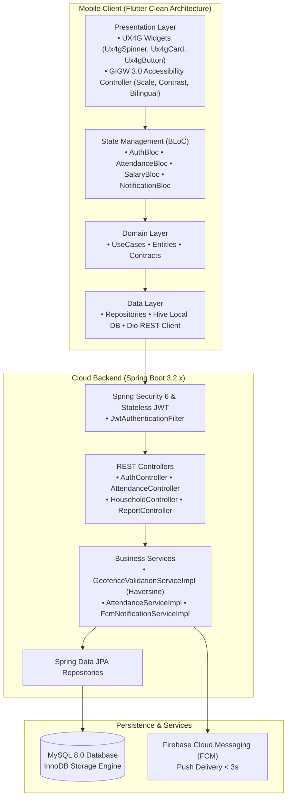

---

## 5. UI/UX Design System Compliance (UX4G & GIGW 3.0)

Sahayika strictly enforces the **Government of India UX4G Design Guidelines** and **GIGW 3.0 (Guidelines for Indian Government Websites and Apps)** standards:

| Parameter | UX4G Specification | Sahayika Implementation |
| :--- | :--- | :--- |
| **Primary Palette** | Civic Blue (`#0B4D8C`) | AppBars, primary CTAs, official headers |
| **Secondary Accent**| Warm Saffron (`#E06A3B` / `#FB923C`) | Shift timers, highlight tags, secondary buttons |
| **Success / Present**| Emerald Green (`#138808` / `#34D399`) | Check-in verified badges, salary settled chips |
| **Dark Theme** | Deep Civic Slate 900 (`#0F172A`) | WCAG AAA 8.2:1 contrast ratio, no harsh OLED eye strain |
| **Card Components** | `Ux4gCard` with subtle borders (`#334155`) | Standard 12px squircle radius with elevation and theme awareness |
| **Loading Indicators**| `Ux4gSpinner` (Arc Sweep Gradient) | Smooth rotational loop, anti-clipping geometry, size presets (16, 24, 36, 48px) |
| **Accessibility Scale**| Font sizing: A- (0.85x), A (1.0x), A+ (1.20x) | Managed by persistent `AccessibilityController` |
| **Bilingual Toggle**| Single-tap Hindi / English toggle | Instant localized UI text without restarting the app |
| **Screen Readers** | GIGW 3.0 / WCAG 2.1 AAA Semantics | `Semantics(liveRegion: true)` on timers, radar, and spinners |

---

## 6. Database Schema & Data Dictionary (MySQL 8.0)

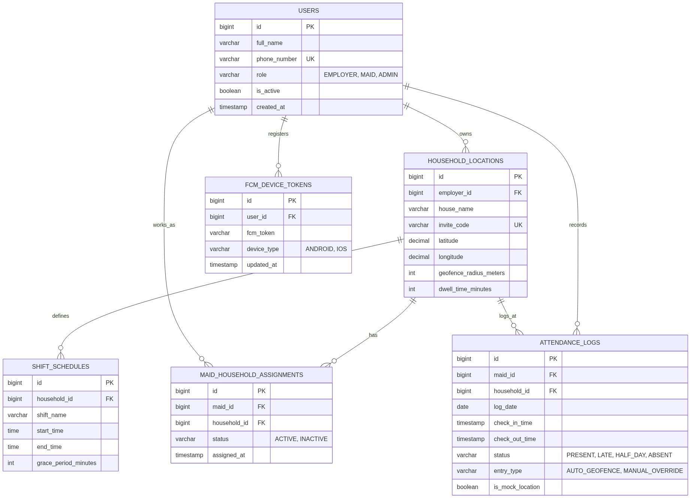

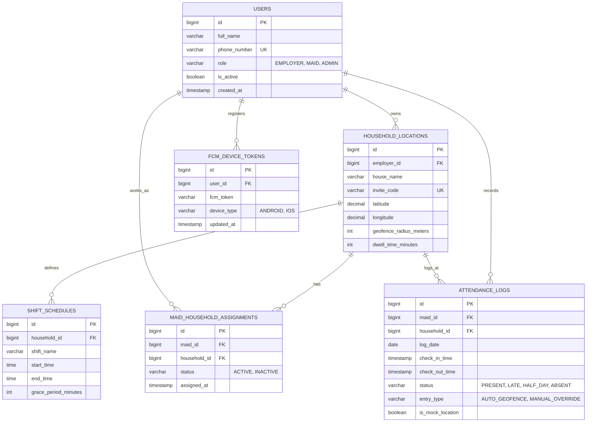

---

## 7. Zero-Cost ($0) Production Cloud Deployment Strategy

Sahayika is engineered to run at **$0 infrastructure hosting cost** for residential communities and public pilots:

| Component | Platform / Service | Free Tier Allocation | Capability |
| :--- | :--- | :--- | :--- |
| **Compute / Backend** | **Oracle Cloud Always Free VM** | 4 ARM Ampere vCPUs, 24 GB RAM | Runs Spring Boot 3.x, JVM 17, and NGINX Reverse Proxy for 100,000+ daily requests. |
| **Relational Database**| **Aiven.io / TiDB Cloud** | 1 GB Free Tier with SSL encryption | Accommodates over 1.5 million attendance log rows before archiving. |
| **Push Notifications** | **Firebase Cloud Messaging (FCM)** | Unlimited Free Tier | Sub-second push notifications across all Android and iOS devices. |
| **Mapping Engine** | **OpenStreetMap & Leaflet** | Open-Source / 100% Free | No Google Maps API billing or credit card requirements. |
| **Mobile App Dist** | **GitHub Releases / Direct APK** | Free Unlimited Downloads | Instant distribution without mandatory $25 developer account during pilot phase. |
| **Monthly OpEx** | **Total Operating Expense** | **₹0 / Month ($0.00)** | Fully sustainable for community RWAs, municipal bodies, and welfare NGOs. |

---

## 8. Summary of Fallback Mechanisms & Edge Scenarios

| Edge Scenario | System Response & Mitigation |
| :--- | :--- |
| **Feature / Keypad Phone** | Employer utilizes **Manual Override** (`entry_type = 'MANUAL_OVERRIDE'`) with reason logging (e.g. *“कीपैड फोन / साधारण फोन”*). |
| **Phone Forgotten at Home** | Householder marks attendance via 1-tap manual override from their dashboard; prevents helper loss of pay. |
| **GPS Drift / Rainy Weather** | Dwell-time buffer (3 minutes) tolerates momentary GPS drift without interrupting valid sessions. |
| **Fake GPS App Installed** | Hardware `isFromMockProvider()` check immediately flags fraudulent logs with warning badges. |
| **Elevator Cellular Blackout** | Local encrypted Hive storage buffers attendance and syncs automatically within 10 seconds of reconnecting. |

---

## 9. Conclusion & Next Steps

**Sahayika (सहायिका)** bridges the trust gap between urban families and domestic workers through automated technology, ethical privacy guardrails, and transparent payroll calculations. 

With all 35 tests verified, UX4G compliance established, clean zero-touch pipelines implemented, and code synchronized with GitHub, the platform is ready for pilot deployment in target residential communities.
